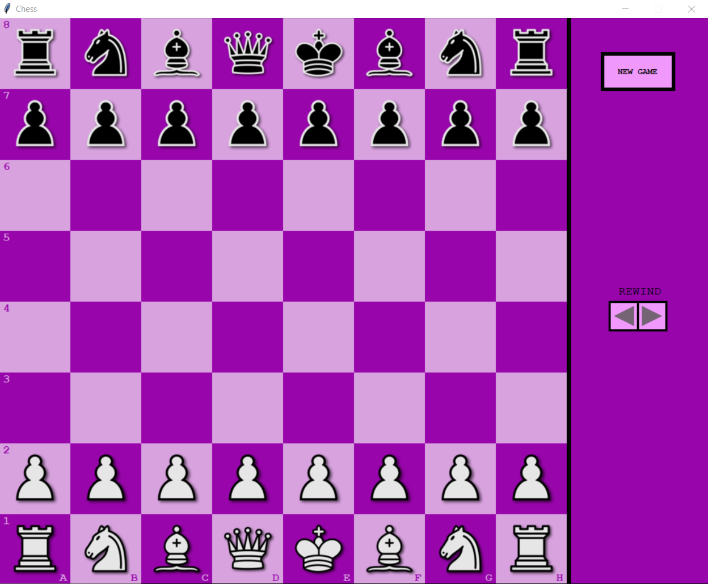

# Python Graphic Chess Application

Implemented features:
- graphic representation of the board (using Graphics.py module)
- game controlled by mouse
- standard chess moves (moving, taking, castling, en passant)
- displaying all possible moves
- not displaying illegal moves i.e. moving over pieces (does not apply to knight) and moves that will allow current player's king to be taken in next move by enemy player
- denying rights to castle (if king or rook have been moved)
- displaying previous states of the game (rewinding moves)
- restoring previous states of the game (game will be continued from chosen previous state)
- starting new game
- action sounds

